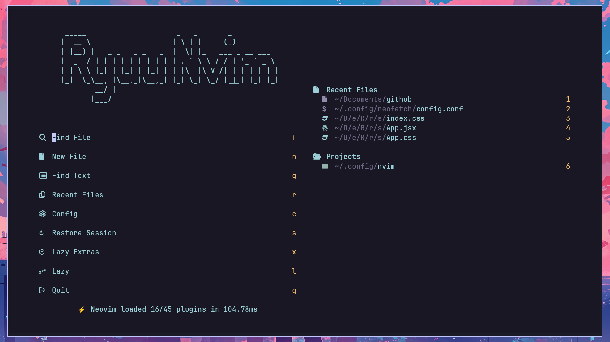
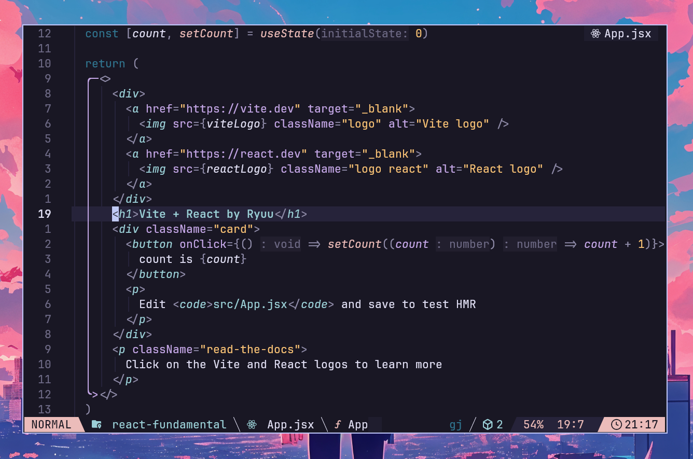

# My LazyVim Configuration

## 🚀 Installation
**⚠ WARNING: Pastikan untuk membackup konfigurasi Neovim sebelumnya!**

1. Clone repository ini ke dalam folder konfigurasi Neovim:
   ```bash
   git clone https://github.com/Ryuuusuke/LazyVim-conf.git ~/.config/nvim
   ```  
2. Hapus folder `.git` agar bisa diunggah ke repository GitHub pribadi:
   ```bash
   rm -rf ~/.config/nvim/.git
   ```  
3. **Selesai!** Jalankan Neovim untuk melihat konfigurasi yang telah diterapkan.

## 📦 Dependencies
Pastikan sistem memiliki dependensi berikut agar konfigurasi berjalan dengan baik:
- [Neovim](https://neovim.io/) (versi terbaru disarankan)
- [Git](https://git-scm.com/)
- [Nerd Fonts](https://www.nerdfonts.com/) (untuk ikon yang lebih baik)
- [Ripgrep](https://github.com/BurntSushi/ripgrep) (untuk pencarian cepat)

## 🎨 Preview
  
  

📅 *Screenshot diambil pada Februari 2025.*  
Jika ingin menggunakan tema yang sama dengan preview di atas, gunakan branch `25-02`:
```bash
git clone -b 25-02 https://github.com/Ryuuusuke/LazyVim-conf.git ~/.config/nvim
```

## 🔧 Customization
Untuk menyesuaikan konfigurasi lebih lanjut, edit file berikut:
- **`lua/custom/init.lua`** – Konfigurasi utama
- **`lua/custom/plugins.lua`** – Plugin tambahan
- **`lua/custom/keymaps.lua`** – Custom keybindings

## ❓ Support & Issues
Jika ada masalah atau ingin memberikan saran, silakan buat [Issue](https://github.com/Ryuuusuke/LazyVim-conf/issues) di repository ini. 🚀


